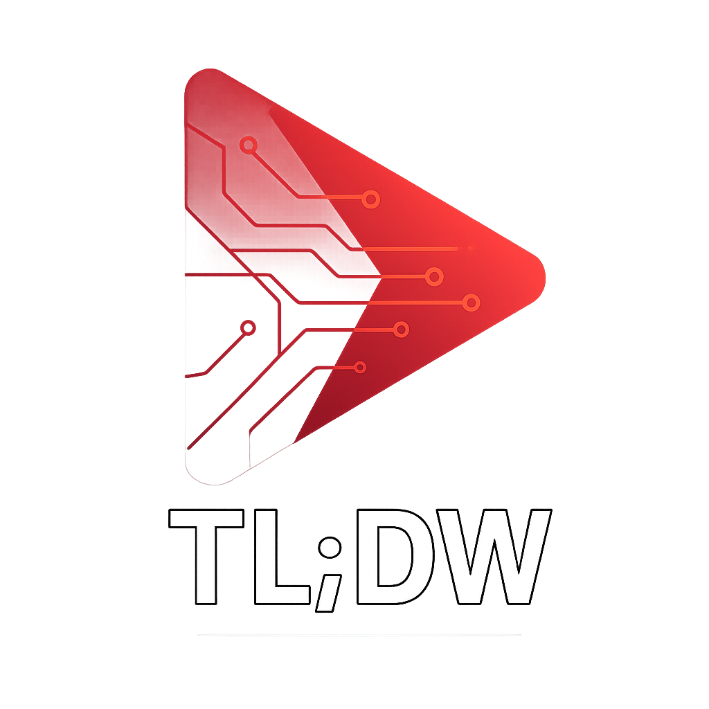

# TL;DW - AI-Powered YouTube Video Summaries



**TL;DW** is a web application that saves you time by providing AI-powered summaries of YouTube videos. Paste a YouTube link and get the key takeaways instantly, without watching the whole video.

## Features

- **AI-Powered Summaries:** Get concise and accurate summaries of any YouTube video.
- **Streaming Responses:** See the summary generated in real-time.
- **Sleek Interface:** A modern and user-friendly interface for a smooth experience.
- **Time-Saving:** Avoids long intros, ads, and filler content to get straight to the point.

## Tech Stack

- **Frontend:** [Next.js](https://nextjs.org/), [React](https://react.dev/), [Tailwind CSS](https://tailwindcss.com/)
- **Backend:** [FastAPI](https://fastapi.tiangolo.com/), [Python](https://www.python.org/)
- **AI:** [OpenAI](https://openai.com/)
- **Deployment:** [Fly.io](https://fly.io/)

## Getting Started

### Prerequisites

- [Node.js](https://nodejs.org/en) and [pnpm](https://pnpm.io/)
- [Python](https://www.python.org/) and `pip`
- [Docker](https://www.docker.com/) (for local backend setup)

### Installation

1.  **Clone the repository:**

    ```bash
    git clone <repository-url>
    cd tldw-site
    ```

2.  **Setup Backend:**

    - Navigate to the backend directory: `cd backend`
    - Set up your environment variables by copying the example:
      ```bash
      cp .env.example .env
      ```
    - Fill in your `OPENAI_API_KEY` and other variables in the `.env` file.
    - Run the backend server:
      ```bash
      docker compose up -d && docker logs tldw -f
      ```

3.  **Setup Frontend:**
    - In a new terminal, navigate to the frontend directory: `cd frontend`
    - Install dependencies:
      ```bash
      pnpm install
      ```
    - Run the development server:
      ```bash
      pnpm run dev
      ```

## Linting

To run the linter and check for code quality, run the following command in the `frontend` directory:

```bash
pnpm run lint
```

## Deployment

This project is configured for deployment on [Fly.io](https://fly.io/).

1.  **Create a Fly.io app:**

    ```bash
    fly apps create tl-dw
    ```

2.  **Import secrets:**
    Make sure your `.env` file is populated, then run:

    ```bash
    fly secrets import < .env
    ```

3.  **Deploy the application:**
    ```bash
    fly deploy
    ```
